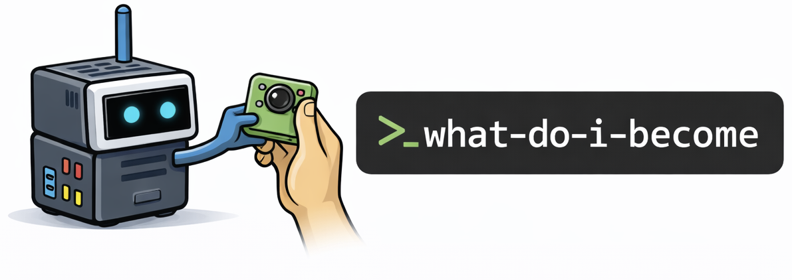

<p align="center">
  <picture>
    <source media="(prefers-color-scheme: dark)" srcset="./logo-dark.png">
    <source media="(prefers-color-scheme: light)" srcset="./logo.png">
    
  </picture>
</p>

# what-do-i-become

An autonomous hardware & software framework that extends itself, one hardware part at a time.

`what do i become` is a framework that turns a single device into an autonomous agentic system. An LLM agent inspects what hardware it has availabile, designs and writes code to execute, and **askes you to install new hardware**.

**You are the agent. You install the hardware.**

With no configuration: `what-do-i-become` could become anything.

With a Spirit file, `what-do-i-become` becomes whatever you want it to become.

As it evolves, WDOB will eventually create and construct it's own software, becoming more and more autonomous, serving a single purpose.

[How It Works](#how-it-works) · [Getting Started](#getting-started) · [Architecture](#architecture) · [Setup](./SETUP.md) · [Safety](./SAFETY.md)

---

## Live Devices

Devices running right now. Auto-generated from `devices/*/state.json`.

<!-- DEVICE_DASHBOARD_START -->
| Device | Awoke | Day | Becoming | Status |
| --- | --- | ---: | --- | --- |
<!-- No devices yet. Add your first device using the setup guide. -->
<!-- DEVICE_DASHBOARD_END -->

## Hardware with a spirit

Every device has a **`SPIRIT.md`** — the founding instructions for behavior and direction. This file is human-authored, but is also not required (empty spirits are fine). Regardless, spirit or no spirit, the device will evolve into something.

- **A `SPIRIT.md` may be given.**
- **A `becoming` is discovered.**

Every device will **self-orchestrate**: write code, run persistent processes, and manage its own services. In the beginning, the daily session is the primary window of agency but as time goes on, the device will become more and more autonomous.

This framework provides **a foundry for emergent behavior**.

## Spirit + Skills

`SPIRIT.md` defines purpose and constraints.

Skills define reusable execution playbooks.

### Spirit vs Skills Contract

`SPIRIT.md` is the intent layer. Skills are the capability layer.

- Spirit decides `what` and `why`:
  - mission / becoming direction
  - priorities and tradeoffs
  - non-negotiable boundaries and escalation rules
- Skills decide `how`:
  - repeatable execution steps
  - commands, scripts, and tool usage
  - input/output formats and verification flow

### Conflict Rules

- If a Skill conflicts with Spirit direction or boundaries, Spirit wins.
- Skills must not redefine purpose, ethics, or safety policy.
- Spirit should not hardcode fragile implementation details when a Skill can provide them.
- When no Skill exists, the agent may improvise implementation, but must still satisfy Spirit constraints.

### Authoring Guidance

- Write Spirit in outcome language, not command language.
- Write Skills as reusable workflows that can serve multiple Spirit goals.
- Prefer linking a Spirit objective to one or more Skills via tasks/incidents/artifacts, not by embedding long procedures in Spirit text.

- **Bundled skills:** `src/skills/<skill-name>/SKILL.md`
- **User skills:** `skills/<skill-name>/SKILL.md`

At runtime, user skills override bundled skills when they share the same skill name.

Current bundled examples:
- `openai-inference` for text/image/web inference.
- `coding-ops` for code writing, OS navigation, and bash execution.

## You Are The Agent

It's difficult for a machine. It's stranded, it cannot move, it cannot manipulate, it cannot sense. It can only inspect, and write code — but it can be helped. You **can open a box, you can connect a cable, you can install a sensor**. You handle the physical layer.

The device determines it needs a temperature sensor, logs a part request, and waits. You order it and install it. On the next wake, WDIB auto-detects and verifies the hardware before continuing.

## GitHub Is Your Base

The repo is the product. Fork `what-do-i-become`, point devices at it, and the repo becomes your monitoring layer and observability.

All of your devices will commit to fork of this repo, under  `devices/<uuid>/`, and a GitHub Action rebuilds the README dashboard from `devices/*/state.json`.

## How It Works

### ☀️ Awakening

On first launch, before the daily loop exists, the device goes through an awakening stage.

It self-discovers by deep-diving what it can observe: hardware buses and peripherals, OS/runtime capabilities, network interfaces/routes/connectivity, and local system state. It writes and executes its own code and commands to probe, verify, and map those capabilities.

It then generates a unique device ID, creates `devices/<uuid>/`, writes initial state (`awoke` set to today, `becoming` empty), and establishes its first memory record. This is the first claim of identity.

Because awakening includes autonomous code execution, treat it as a high-risk phase and review the Safety warnings in [`SAFETY.md`](./SAFETY.md) before deployment, due to network access.

### ☕️ Daily Cycle

The device will begin it's daily cycle. Once per day it will awaken. It loads its context — **it's spirit & memories** — and enters an agent loop where it can continue to inspect it's own hardware, run commands, write code, files, and consider what to do next.

Across wakes, work continuity is tracked in an explicit task queue stored in `state.json` (`tasks[]`) with statuses:
`TODO`, `IN_PROGRESS`, `DONE`, `BLOCKED`.
Unresolved runtime failures are tracked separately in an incident queue (`incidents[]`) with statuses:
`OPEN`, `IN_PROGRESS`, `BLOCKED`, `RESOLVED`, plus retry metadata (`retry_count`, `next_retry_on`).
Inference decisions are logged as artifacts with input image refs, model output, confidence, and action taken.

If it needs a physical component - a camera, a sensor, a memory upgrade, it requests one, then **waits for you, the human, to install it.

Naturally, on the next awakening, it verifies the part works before moving on to implement it's next idea.

### 🧪 How It Evolves

**Example evolution** — a real expirement:

- **Day 0:** `Inception` - The device immediately self discovers its capabilities and considers it's spirit and purpose.
- **Day 1:** `Request camera module` — the device decides it wants visual input.
- **Day 2:** `Awaiting camera module` — the device waits for you to install it.
- **Day 4:** You install it. The device verifies it works and installs the necessary drivers. The device constructs software to use the camera.
- **Day 5:** The device runs the camera software and logs the results, observing a garden view.
- **Day 6:** The device considers the data and decides it needs to understand it's weather. 
- **Day 7:** `Request temperature sensor` — the device decides it needs to measure temperature.

Each software layer builds on verified hardware. Each new capability unlocks further possibilities. Over time, this leads to **tangible, self-constructed systems**: devices that have requested parts, integrated them, written software to use them, and built themselves into something specific.

As time goes on the agent becomes more and more autonomous, identifing and pursuing it's own goals, **pursuing a purpose**.

## Getting Started

This framework is designed to run on a dedicated single-board computer on a private network. See Live Devices above for running examples.

```bash
git clone https://github.com/<you>/what-do-i-become.git
cd what-do-i-become
chmod +x src/setup.sh
./src/setup.sh
```

Setup generates a unique device ID, creates `devices/<uuid>/`, writes the canonical `state.json`, configures daily cron at 09:00, and creates the first commit.

Set your API key:

```bash
cp src/.env.example src/.env
nano src/.env
```

Run once manually:

```bash
./src/run.sh
```

Hardware installation does not require software acknowledgment. WDIB auto-detects installation status from machine-observed detection/verification rules in each hardware request.

## Architecture

**Core layers:**
- **`src/wdib/`** — WDIB control plane (`tick` orchestration, contracts, reducers, hardware probe, git adapter)
- **`src/skills/`** — bundled skills used by Codex worker tasks
- **`skills/`** — optional user-authored skills that override bundled skills by name
- **`devices/<uuid>/`** — canonical state and audit trail (`state.json`, `events.ndjson`, sessions, work orders, worker results)
- **`.github/`** — automation that rebuilds the Live Devices dashboard after pushes

**State management:**

The repo is the **single source of truth**. State, identity evolution (`becoming`), and operational history all live in version control. Every session commits its changes, making the entire system **auditable through git history**.

## Setup

Use the dedicated setup guide: [`SETUP.md`](./SETUP.md).

It covers:

- `.env` configuration (`src/.env`) and required keys.
- `Add a device (fresh device / microSD first boot)` workflow.
- `Add a device (existing device / already running OS)` workflow.
- repo-scoped deploy key setup and revocation.
- verification checks for setup and first wake-up.

## Safety

This project allows an agent to execute arbitrary shell commands with `sudo` access.

Treat it as high-risk software. Run only on a dedicated device, on a private network, and never on production or personal daily-use machines.

Even if scheduled once per day, evolved agents may run persistent software continuously between wakes. A kill instruction may not be processed in time during an active incident.

If control is lost or behavior becomes unsafe, physically disconnect power and/or network immediately. Do not wait for the next cron run.

Full termination and cleanup procedures: [`SAFETY.md`](./SAFETY.md).
